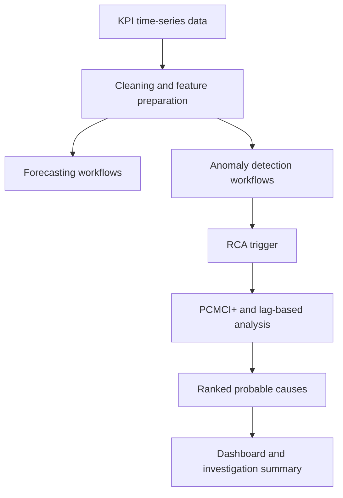

# RCA, Anomaly, and Forecasting Workflows

Documentation for diagnostic workflows connected to infrastructure monitoring.

> Proprietary code, internal datasets, and operational details are not included. This repository documents system design and sanitized implementation details.

## Summary

This work productized forecasting, anomaly detection, and root-cause analysis as recurring workflows inside an internal monitoring platform. Outputs were connected to dashboards, scheduled jobs, alert investigation, and operator-facing summaries.

## Scope

- 5 anomaly detection models
- 16 RCA models
- Recurring inference workflows
- Ranked probable-cause outputs
- Dashboard-connected anomaly visibility
- RCA-triggering support from anomalous KPI behavior
- Checkpointed orchestration and recovery

## Workflow

## Engineering Scope

- Recurring processing and inference workflows
- Forecasting and anomaly outputs integrated into dashboards
- RCA outputs built around ranked probable causes and graph-style reasoning
- Checkpointing and recovery patterns for scheduled workflows
- Diagnostic results connected to operator workflows

## Methods

- Time-series forecasting
- Anomaly detection
- PCMCI+ and lag-based RCA analysis
- Scheduled orchestration
- Dashboard-connected investigation summaries

## Tech Stack

Python, PySpark, Airflow, time-series processing, anomaly detection, forecasting, root-cause analysis, Elasticsearch-backed analytics, dashboard integration.
