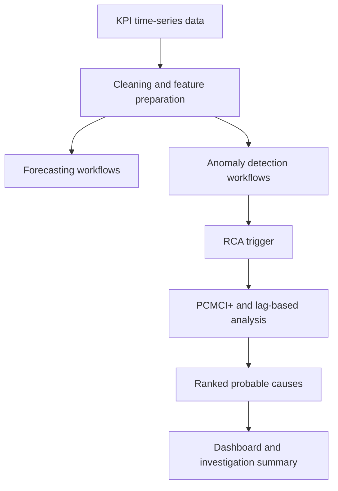

# RCA, Anomaly, and Forecasting Workflows

Documentation-only case study for production-style diagnostic workflows connected to infrastructure monitoring.

> Proprietary code, internal datasets, and operational details are not included. The goal is to document the system design and engineering ownership safely.

## Summary

This work productized forecasting, anomaly detection, and root-cause analysis as recurring workflows inside an internal monitoring platform. The outputs were not notebook-only experiments; they were connected to dashboards, scheduled jobs, alert investigation, and operator-facing summaries.

## Confirmed Scope

- 5 anomaly detection models
- 16 RCA models
- Recurring inference workflows
- Ranked probable-cause outputs
- Dashboard-connected anomaly visibility
- RCA-triggering support from anomalous KPI behavior
- Checkpointed orchestration and recovery

## Workflow

## Engineering Responsibilities

- Designed recurring processing and inference workflows
- Integrated forecasting and anomaly results into platform dashboards
- Built RCA outputs around ranked probable causes and graph-style reasoning
- Added checkpointing and recovery patterns for scheduled workflows
- Connected diagnostic results to operator workflows

## Methods Used

- Time-series forecasting
- Anomaly detection
- PCMCI+ and lag-based RCA analysis
- Scheduled orchestration
- Dashboard-connected investigation summaries

## Recruiter Signal

This project demonstrates data and AI engineering delivered as operational software: pipelines, scheduled jobs, backend integration, diagnostic product workflows, and measurable troubleshooting impact.

## Tech Stack

Python, PySpark, Airflow, time-series processing, anomaly detection, forecasting, root-cause analysis, Elasticsearch-backed analytics, dashboard integration.
